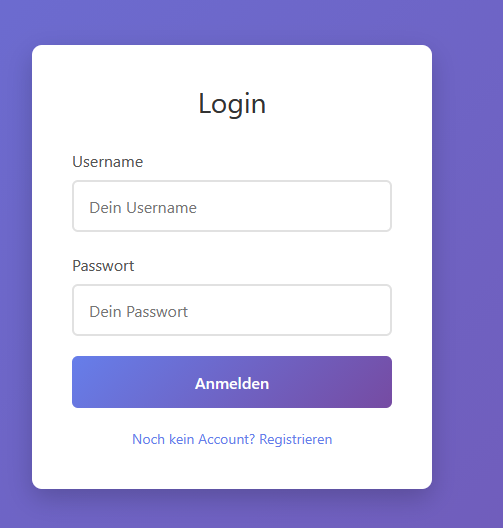
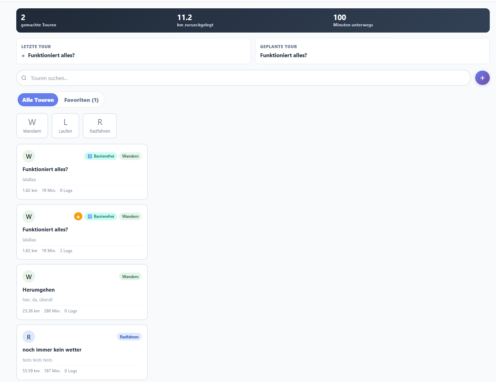
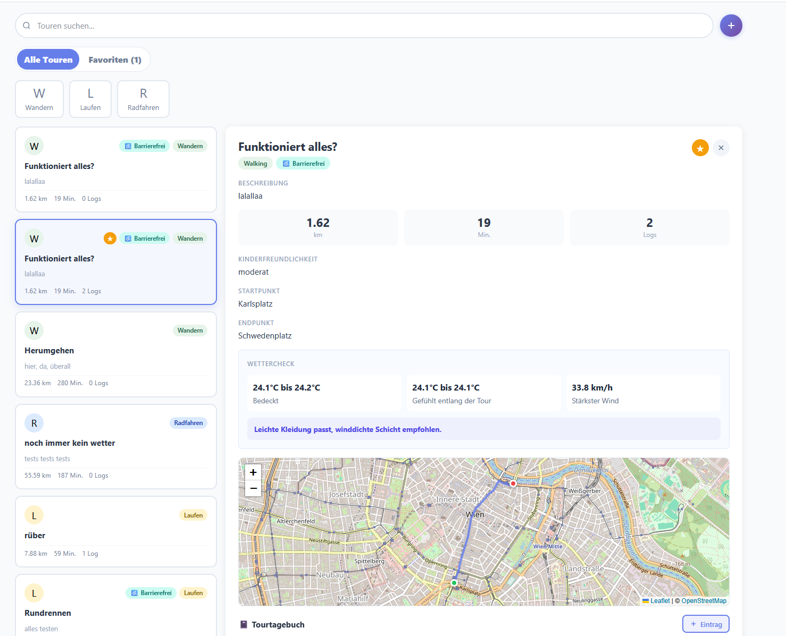
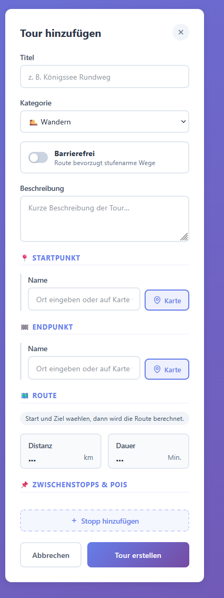
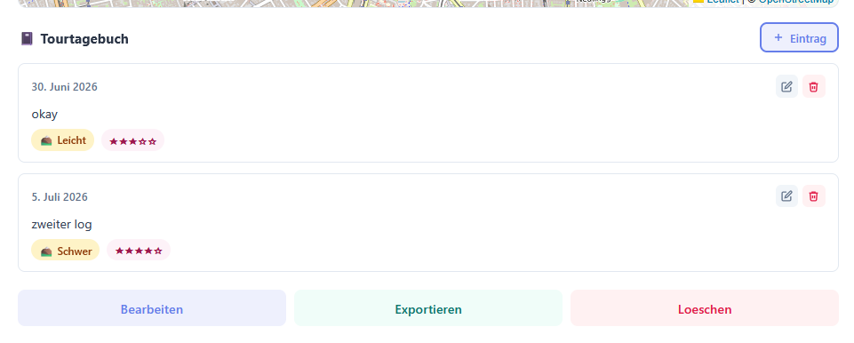
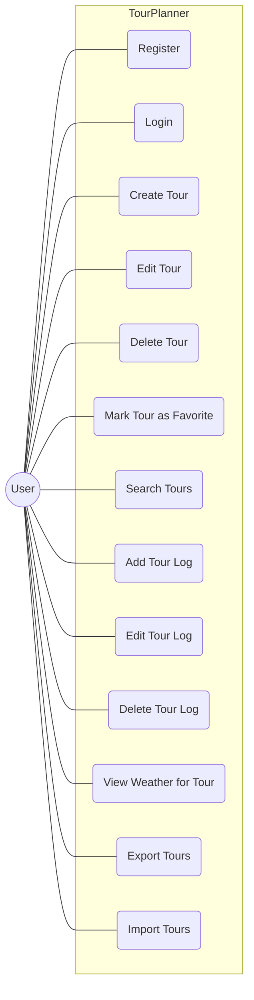
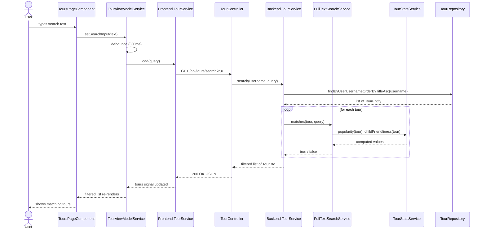

# TourPlanner – Project Protocol

## 1. Overview

TourPlanner is a web application for planning and tracking tours (hiking, running, and cycling). Users register an account, create tours with a start point, an end point, and optional waypoints. They can log completed attempts with a comment, difficulty, distance, time, and a rating. From these logs the app derives a popularity score and a child-friendliness rating. Computed and stored values are also part of a full-text search that covers tours and logs.

The frontend is an Angular application built around the MVVM pattern. The backend is a layered Spring Boot application (presentation, business logic, data access) backed by PostgreSQL through Spring Data JPA/Hibernate. Routing and geocoding rely on three external services — OpenRouteService, OSRM, and Nominatim. The distinct roles are explained in section 4. Current weather and a per-tour weather summary make up a unique feature.

**Team:** Freisinger Christopher, Kluge Viktoria
**Repository:** https://github.com/ViktoriaKluge/SwenTourPlanner

---

## 2. Architecture

### Backend

The backend uses a three-layer architecture.

- **Presentation layer** (`controller`) – REST controllers that expose the API and translate HTTP requests into service calls.
- **Business layer** (`service`) – the business logic and validation.
- **Data access layer** (`repo`) – Spring Data JPA repositories that talk to PostgreSQL.

Additionally, `model` holds the JPA entities and `dto` holds the objects that cross the REST boundary. A `TourMapper` converts between the two, so entities never leave the service layer directly.

### Frontend

The frontend uses the Angular MVVM pattern.

- **Views** (`features/*/`) – standalone components that render the UI.
- **ViewModels** (`features/*/view-model`) – hold the UI state as signals.
- **Data access** (`features/*/data-access`) – services that call the backend over `HttpClient`.

Views never call the data-access layer directly. They only talk to the ViewModel. The ViewModel is the single source of truth for the UI state.

### Frontend/backend communication

The frontend and backend communicate over HTTP with JSON. Every request except `/api/auth/**` carries a JWT in the `Authorization` header. An Angular interceptor adds the token automatically. The backend reads the username from the token. This means a user can never access another user's data by sending a different username.

## 3. Design Patterns

**Repository pattern.** Repositories (`TourRepository`, `TourLogRepository`, `UserRepository`) handle all database access. Spring generates the queries from the method names. No SQL is written by hand anywhere in the project.

**DTO / Mapper pattern.** `TourDto`, `TourLogDto`, and `AuthRequest` define what crosses the REST boundary, separate from the JPA entities. `TourMapper` converts between entity and DTO, so persistence details stay out of the API contract.

**Service layer pattern.** Business logic lives in dedicated services (`TourService`, `AuthService`, `TourStatsService`, `FullTextSearchService`, `WeatherService`, `OpenRouteServiceClient`). Controllers only validate the request and delegate to a service.

**MVVM (frontend).** Each feature has a ViewModel service that holds state as Angular signals, and a data-access service that talks to the backend. Components only read from and call the ViewModel. They never reach into the data-access layer directly or hold their own copy of the data.

**Layer-specific exceptions.** We define our own exception types: `BadRequestException` (400), `InvalidCredentialsException` (401), and `NotFoundException` (404). A single `RestExceptionHandler` maps each to the right HTTP status and a JSON error body, so services stay decoupled from HTTP concerns.

## 4. Technical Decisions

### Routing & geocoding architecture

We use three external services for routing and geocoding, each with a different role.

- **Nominatim** (OpenStreetMap) handles geocoding: turning a place name into coordinates. It's free, needs no API key, and is used for the location search in the tour form.
- **OSRM** provides the routing preview in the frontend while a tour is being created. It's also free and keyless, but it's only used for the live preview and is normally not stored.
- **OpenRouteService (ORS)** computes the final route on the backend when a tour is saved. It overwrites the geometry, distance, and duration with the values that end up in the database.

ORS stays out of the frontend because the API key would be visible in the browser. Calling Nominatim and OSRM directly from the browser is fine, since neither needs a key.

Running both OSRM and ORS is redundant because both run on every tour creation, but if ORS fails, the OSRM route is saved instead. This was intentional. OSRM acts as a client-side fallback, so the user still gets a route even when the backend routing service is unavailable.

### Environment configuration

Spring Boot doesn't load `.env` files by itself. We tried `spring-dotenv`, but it isn't compatible with Spring Boot 2.7. Instead, `TourPlannerApplication` loads the file manually, before the Spring context starts. It looks for `.env` in the current directory first, then under `backend/.env`, and sets any missing key as a system property. Real environment variables always take priority and are never overwritten. `backend/.env` is excluded from Git, so API keys never end up in the repository.

### JWT authentication

We use JWT because the API is stateless, so there's no server-side session store to manage. Login and register return a signed token (`com.auth0:java-jwt`), and the frontend attaches it to every request afterwards.

Ownership is derived from the token, not from anything the client sends. Every tour/log endpoint reads the username through `Principal`, which is filled in with the validated JWT. This matters because an earlier version of the API read the username from a client-supplied `X-User` header, so any authenticated user could put in someone else's username and reach their data. Switching to JWT alone wouldn't have fixed that, so the ownership is never taken from client input at all, regardless of how the request is authenticated.

We kept the implementation deliberately minimal: no refresh tokens or token blacklisting. For our project, this complexity was enough.

We also used Spring Security's built-in `UsernamePasswordAuthenticationToken` instead of writing a custom `Authentication` implementation, since it already covers what we need.

### Computed attributes: popularity & child-friendliness

Popularity and child-friendliness are not stored in the database. `TourStatsService` computes both every time a tour is loaded, from the tour's logs.

We chose this over storing the values because it avoids inconsistencies when tours / logs get edited or deleted. 

Popularity is simply the number of logs a tour has. Child-friendliness is derived from the average difficulty, distance, and time across all logs, and falls into one of four levels (child-friendly, moderate, demanding, or unknown when there are no logs yet). Both values are included in the full-text search index, so searching for e.g. "child-friendly" returns matching tours.

### Wheelchair routing discrepancy

OSRM, which powers the live preview, has no wheelchair profile. When a tour is marked accessible, it falls back to the regular `foot` profile. ORS, which computes the final route, does have a dedicated `wheelchair` profile. This means the preview and the saved route can have different paths, sometimes a longer distance.

We didn't try to fix this technically, since matching ORS's wheelchair routing on the frontend isn't realistic without giving the frontend its own ORS access. Instead, the tour form shows a note when accessibility is enabled, telling the user that the final route may differ from the preview.

## 5. Wireframes / UX

These screenshots show the actual UI.

**Login**

Registration uses the same form, with one extra field for the password confirmation.

**Tour overview**

The stats bar at the top shows tours completed, total distance, and total time. Below that: search, transport-type filters, and the tour list itself, with a badge for accessible tours and the log count per tour.

**Tour detail**

Selecting a tour opens the detail view next to the list: computed child-friendliness, the route on the map, a weather summary with clothing advice, and the tour log underneath.

**Tour form**

Creating or editing a tour: title, transport type, accessibility toggle, description, start/end point, the computed route (distance/duration), and optional waypoints.

**Tour logs**

Each log entry shows difficulty and rating, with edit/delete actions. Below the log list are the actions for the whole tour: edit, export, delete.

**FAQ**

Reachable from the "More" menu. A short page answering the questions users are most likely to have: how popularity and child-friendliness are calculated, why the accessible route can differ from the preview, what export/import do, what the search covers, and how the weather check works.

## 6. Logging

The backend uses SLF4J with Logback, Spring Boot's default logging setup, configured through `application.yml`.

What gets logged:

- **Warnings** for anything that reaches the client as an error: validation failures, authentication failures, not-found errors, and import-limit violations. Security-relevant cases (a failed login, an attempt to reach another user's tour) include the username, so they can be traced back to an account.
- **External service failures** (ORS, OpenWeather) as warnings, since these are expected to fail occasionally — a stale API key, a timeout, no route found — and shouldn't crash the request.
- **Info-level logs** for normal operations such as registration, login, and tour/log CRUD, so the log gives a rough picture of usage even without errors.
- On the frontend, network and API errors (OSRM, Nominatim) go to the browser console with `console.error`, since there's no server-side log for client-only failures.

A single `RestExceptionHandler` centralizes HTTP error logging: every custom exception (`BadRequestException`, `InvalidCredentialsException`, `NotFoundException`) and `MethodArgumentNotValidException` gets logged there, in addition to any more specific log written at the point where the error occurred. Some errors end up logged twice this way — once with full context near the source, once generically in the handler. We kept both rather than removing the handler's logging, since it still acts as a catch-all for anything a source-level log might miss.

Field-level validation errors don't include the username, since it isn't reliably available at that point in the request.

## 7. Unique Feature

Our unique feature is a weather check for tours, built on the OpenWeather API.

Two endpoints back it: `GET /api/weather/current` returns the current weather for a single coordinate, and `POST /api/weather/tour-summary` returns a summary across an entire tour, sampling multiple points along the route instead of just the start point, since a long tour can span different conditions.

Beyond the raw weather data, `WeatherService` turns it into clothing advice: a feels-like temperature range classified as cold, mild, or hot, a rain warning if the forecast description mentions rain, and a wind warning above 30 km/h.

Without a configured API key, or when a tour has no usable coordinates, the endpoints return a clear "not configured" or "unavailable" response instead of an error, and the frontend shows a message asking the user to check the weather manually instead of displaying broken or empty data.

## 8. Unit Testing Strategy

The backend has 63 JUnit tests across 9 test classes, all running against plain objects or Mockito mocks.

We prioritized what to test in this order:

1. **Security and data isolation** first: registration/login rules, and that a user can never read, update, or delete another user's tours or logs. This is the most sensitive part of the app, so it came before anything else.
2. **Complex logic we own**: which tour changes should trigger a re-route, entity/DTO mapping (especially null handling and the JSON-serialized route geometry), and the request assembly for OpenRouteService (waypoint order, the running-speed correction).
3. **Gaps found on a second pass**: `JwtUtil`, the actual authentication mechanism, had no tests at all, and neither did `WeatherService`, our mandatory unique feature. Both were added afterward.

`RestExceptionHandler` is untestd because it would need a full Spring context (e.g. via `MockMvc`) to test properly. And some runtime behavior around Hibernate's entity cascading isn't reproducible with a plain unit test either.

## 9. Use Cases

Mermaid has no dedicated UML use-case shape, so this is drawn as an actor connected to its use cases inside the system boundary.

## 10. Sequence Diagram: Full-Text Search

